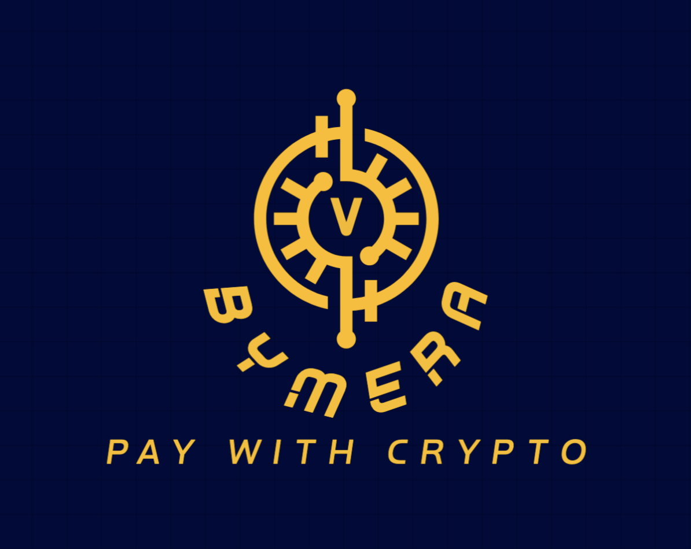

# Bymera

Universal crypto payment bridge — pay with crypto on sites that only accept cards.



Bymera is a browser extension + backend system that lets users pay with cryptocurrency anywhere a card is accepted. The extension detects card checkout forms, funds a virtual card (via a backend that talks to Lithic and smart contracts), and auto-fills the merchant's card form so the merchant processes a normal card payment.

## Why this project

Most merchants only accept cards, forcing users to off-ramp crypto to fiat. Bymera removes that friction by creating a merchant-agnostic virtual card funded by crypto, enabling seamless payments without requiring merchants to integrate Web3.

## Key features

- Works on any site with a card checkout form
- One-click payments from crypto wallets
- Virtual cards issued via Lithic (sandbox/support)
- Privacy-first: merchants only see card data, not crypto details
- Cross-chain / EVM-compatible support

## Repository layout

- `extension/` — browser extension source and manifest
- `backend/` — FastAPI backend that listens to events and creates virtual cards
- `evm/` — smart contracts, Foundry project and tests
- `landing-page/` — marketing / demo Next.js app
- `shared/` — shared types and utilities

## Prerequisites

- Node (or Bun) — used for extension & web UI tooling
- Python 3.10+ (for backend) and uvicorn
- Docker (optional) — for running the backend in a container
- Foundry (optional) — for building/running solidity contracts in `evm/`

## Quick start — local development

1) Backend

```bash
cd backend
cp .env.example .env   # or create .env with values listed in backend/README.md
# Edit .env and set BACKEND_API_KEY, LITHIC_API_KEY (sandbox), DATABASE_URL, WEB3_PROVIDER_URI, CONTRACT_ADDRESS, etc.
uv run uvicorn src.app:app --reload --host 0.0.0.0 --port 8000
# or build/run via Docker: docker build -t vymera-backend . && docker run -d -p 8000:8000 --env-file .env vymera-backend
```

API notes: all backend endpoints require header `X-API-Key: <BACKEND_API_KEY>` (see `backend/README.md` for endpoints and examples).

2) Extension (development)

```bash
# From repo root
bun install     # or npm/yarn install if you prefer
bun run build:extension   # builds/transpiles extension files
```

To load in Chrome/Edge: open chrome://extensions, enable Developer mode, click "Load unpacked" and select the repository root (or the build output folder if your build script writes to a `dist/` or `extension/` folder).

3) Smart contracts (optional)

```bash
cd evm
# Requires Foundry (forge)
forge test
forge build
```

## Running tests

- Solidity tests: `cd evm && forge test`
- Backend: add pytest-based tests in `backend/` and run with `pytest`

## Environment variables

The backend expects a `.env` file with at least the variables described in `backend/README.md` (BACKEND_API_KEY, DATABASE_URL, WEB3_PROVIDER_URI, CONTRACT_ADDRESS, LITHIC_API_KEY, LITHIC_ENVIRONMENT, POLL_INTERVAL_SECONDS).

## Security & notes

- Use Lithic sandbox keys for local/dev. Do not commit secrets.
- When `CONTRACT_ADDRESS` is set to the zero address the listener runs in no-op mode (useful for local dev).

## Contributing

Contributions are welcome. Please open issues or PRs. For development guidelines, add a `CONTRIBUTING.md` with code style and PR process.

## License

MIT

---

If you'd like, I can also:
- add a small `CONTRIBUTING.md` with PR checklist
- add example `.env.example` to `backend/` if missing
- update package scripts to make local dev commands clearer
